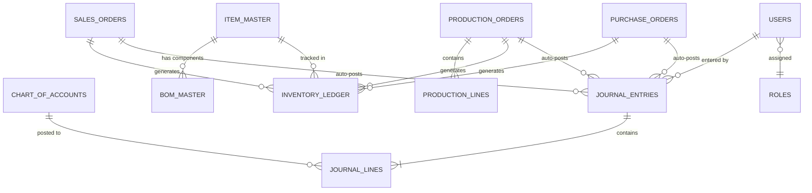

# RPCI Cloud Accounting & Production ERP — Build Specification

**Purpose of this document:** This is the final, consolidated requirement and architecture spec for this project. It is written to be handed directly to an AI coding agent (or a human developer) to build the system from scratch. It supersedes earlier drafts — everything needed to start building is in this one file.

**How to use this document (for the coding agent):** Build in the phase order given in Section 9. After each phase, the acceptance criteria listed must pass before moving to the next phase. Where a business rule is marked `TBD (client)`, implement the stated default/assumption but keep it as a configurable value, not a hardcoded one — the client has not yet confirmed the exact rule.

---

## 1. Project Summary

A cloud-based, multi-user accounting and production-tracking system for a manufacturing/trading company (RPCI), replacing an existing manual Excel-based bookkeeping process. It must be usable from both mobile and laptop browsers, host on AWS at minimal cost (target under $20/month), and support role-restricted access for several staff members.

**Core principle:** the system must never allow the books to become unbalanced. Every transaction — whether entered manually or generated automatically by a production or sales action — must be enforced as a valid double-entry (total debit = total credit) at the database level, not just in the UI.

---

## 2. Business Context

The company tracks its business in five segments, sharing one set of books but reportable separately:

| Segment | Description |
|---|---|
| Import | Imported finished/trading goods |
| Manufacturing | Multi-stage production: raw material → WIP → finished goods |
| Packaging | Packaging materials consumed in production |
| Trading | Locally traded/resold finished goods |
| Application | Service/application income |
| Shared | Overheads/admin not tied to one segment (cash, bank, salaries) |

Every account, item, and transaction line carries a segment tag. This is required to produce **segment-wise Profit & Loss**, in addition to a company-wide P&L.

---

## 3. Functional Requirements (Final)

### 3.1 Chart of Accounts
- Fields: account code, name, type (Asset / Liability / Equity / Revenue / COGS / Expense / Other Income), segment, normal balance (Dr/Cr).
- Only Admin/Accountant roles can create or edit accounts.
- All other modules reference this list — no free-text account entry anywhere in the system.

### 3.2 Opening Balances
- One-time entry as of a cutover date.
- Save must be blocked unless total debit = total credit.
- Locked after cutover; edits after locking require Admin role and are logged (who, when, before/after values).

### 3.3 Journal Entries (manual)
- Multi-line: date, voucher number, account, segment, debit or credit amount, narration, entered-by user.
- Save must be blocked unless the entry balances (sum debit = sum credit).
- Full audit trail on every entry: created-by, created-at, and a log of any edits after posting.

### 3.4 Item Master
- Fields: item code, name, category (Raw Material / WIP / Finished Good / Packaging / Trading / Imported Goods), segment, unit of measure.
- **Quantity on hand and current weighted-average cost are computed fields**, derived from the Inventory Ledger. They must never be directly editable by a user.

### 3.5 BOM Master (Bill of Materials)
- A parent item maps to a list of component items, each with a quantity-per-unit-of-output.
- **Must support multi-stage BOM**: a component may itself be a WIP item that has its own BOM (e.g., raw materials → Stage 1 WIP → Stage 2 WIP → Finished Good). The BOM explosion logic must recurse through all stages.
- Must be able to "explode" a BOM for a target production quantity to show the full multi-level material requirement.

### 3.6 Production Entry (core automation — build this carefully)
Input: item to produce, quantity, list of components consumed (auto-suggested from BOM, quantities scaled to production quantity), labor cost, overhead cost.

On "Post Production," the system must perform the following **as a single atomic database transaction** (all-or-nothing):
1. For each component consumed: reduce its quantity in the Inventory Ledger, valued at its *current* weighted-average cost, and write an "Out" ledger row.
2. Sum consumed component value + labor + overhead = total production cost.
3. Total production cost ÷ quantity produced = unit cost of the output item.
4. Write an "In" ledger row for the output item at the calculated unit cost, updating its running weighted-average cost.
5. Auto-generate a balanced Journal Entry reflecting the movement (e.g., Debit WIP/Finished Goods, Credit Raw Material/WIP for materials consumed, Credit Cash/Payable for labor and overhead).
6. If any step fails, the entire transaction must roll back — no partial ledger or journal updates.

### 3.7 Sales Entry
- Input: customer, item(s), quantity, sale price.
- On posting, atomically: reduce inventory quantity (valued at current weighted-average cost), create a Revenue entry (Debit Accounts Receivable/Cash, Credit Sales) and a COGS entry (Debit COGS, Credit Inventory) in the same journal entry.

### 3.8 Inventory Ledger
- System-maintained, append-only subsidiary ledger of every inventory movement: type (Purchase / Production-In / Production-Out / Sale-Out / Adjustment), item, quantity, unit cost, running balance quantity and value.
- Never directly editable by users — only written by Production Entry, Sales Entry, and Purchase Entry (see 3.9).
- `TBD (client)`: a **Purchase Entry** module was implied but not explicitly in the original workbook. Default assumption: build it, since Production Entry needs a source of incoming raw material stock. Structure it the same way as Sales Entry (mirror image: increases inventory, creates a Payable/Cash and Inventory journal entry).

### 3.9 Reports (all system-generated as live views, never manually entered)
- General Ledger: opening balance + period activity + closing balance, per account, for any date range.
- Trial Balance: as of any date.
- Profit & Loss by Segment: per-segment and company-wide totals, gross margin %.
- Balance Sheet: Assets / Liabilities / Equity, with a balancing check that must always hold.
- Inventory valuation report (quantity and value on hand per item, as of any date).

### 3.10 VAT & Tax — `TBD (client)`
- Build the structure to track Input VAT (from purchases) and Output VAT (from sales) and compute net payable/receivable, but treat the exact rate/rule configuration as a settings table the client can adjust, not hardcoded logic — the exact VAT/AIT/TDS rules have not yet been confirmed by the client.

### 3.11 Payroll — `TBD (client)`
- Build a basic structure (employee list, monthly salary, deductions, net pay, payroll journal posting) but treat the salary structure and statutory deduction rules as configurable — exact structure not yet confirmed by the client.

---

## 4. Roles & Permissions

| Role | Chart of Accounts | Journal Entries | Item/BOM Master | Production Entry | Sales/Purchase Entry | Reports |
|---|---|---|---|---|---|---|
| Admin | Full | Full | Full | Full | Full | Full |
| Accountant | View | Full | View | View | View | Full |
| Store/Production Staff | — | — | Full | Full | — | View (own module) |
| Sales Staff | — | — | View | — | Full | View (sales only) |
| Owner/Viewer | View | View | View | View | View | Full (read-only) |

Permissions must be enforced **server-side** (API layer), not only hidden in the UI — a restricted user must get a 403 from the API even if they somehow reach a UI element.

---

## 5. Non-Functional Requirements

| Category | Requirement |
|---|---|
| Access | Responsive web app (mobile + laptop browsers); no native app required |
| Users | 1–10 concurrent users |
| Hosting budget | Under $20/month, target ~$10–15/month |
| Security | HTTPS everywhere, JWT-based auth, role-based access control, passwords hashed (never stored plain) |
| Data integrity | Double-entry balance enforced at the database/transaction layer, not just in application code |
| Audit trail | Every posted transaction records who/when; edits after posting are logged, not silently overwritten |
| Backups | Automated nightly database backup, retained 30 days, stored separately (S3) |

---

## 6. Technology Stack

| Layer | Choice | Why |
|---|---|---|
| Backend/API | Python + FastAPI | Strong typing/validation for financial data; async support; auto-generated OpenAPI docs |
| Database | PostgreSQL | Transactional integrity required for double-entry accounting; `NUMERIC` type for exact money math; recursive CTEs for multi-stage BOM |
| ORM/Migrations | SQLAlchemy + Alembic | Version-controlled schema changes |
| Frontend | React (as a responsive PWA) | One codebase for mobile + laptop |
| Auth | JWT with role middleware | Simple, sufficient at this scale |
| Hosting | Single AWS Lightsail instance running Docker Compose (API + Postgres + Nginx reverse proxy) | Meets the <$20/month target; avoids RDS/load-balancer overhead unnecessary at 1–10 users |
| DNS/TLS | Cloudflare (free tier) | Free HTTPS + basic protection in front of Lightsail |
| Backups | Scheduled `pg_dump` → S3 | Cheap, simple, sufficient at this scale |

---

## 7. Code Architecture & Modularity Requirements

**This section is a hard requirement, not a suggestion — code that doesn't follow this structure should be considered incomplete.**

The system must be built so a human can open any one module folder and understand/maintain it without reading the whole codebase. Concretely:

### 7.1 Backend folder structure (feature-modules, not one giant app)
```
backend/
  app/
    core/              # config, security/auth, db session, shared exceptions
    modules/
      accounts/        # Chart of Accounts
        models.py      # SQLAlchemy models
        schemas.py      # Pydantic request/response schemas
        service.py      # business logic — no DB queries or HTTP here beyond calling repository
        repository.py   # all DB queries for this module live here
        router.py       # FastAPI routes — thin, calls service.py only
        tests/
      journal_entries/
      items_bom/
      production/
      sales_purchase/
      inventory_ledger/
      reports/          # GL, TB, P&L, Balance Sheet — implemented as read-only views/queries
      users_roles/
      vat_tax/
      payroll/
    main.py             # wires routers together, app startup
  alembic/               # migrations
  tests/                 # integration tests across modules
```

### 7.2 Rules for the coding agent to follow
- **One module = one folder.** A module's router must never directly run a raw SQL/ORM query — it calls its `service.py`, which calls its `repository.py`. This keeps business logic (e.g., the weighted-average costing formula) in one obvious, testable place, not scattered across route handlers.
- **No function should exceed ~50 lines.** If it does, split it — this keeps each piece reviewable by a human.
- **Every module ships with its own tests** covering at minimum: the happy path, an unbalanced-entry rejection, and (for production/sales) the atomic-transaction rollback case.
- **Type hints and docstrings are mandatory** on every function — the codebase should be self-documenting enough for a human developer to pick up without asking the AI agent to re-explain it.
- **Configuration (VAT rates, DB credentials, etc.) lives in environment variables / a settings table — never hardcoded.**
- **Money values use `Decimal`/`NUMERIC` throughout — never floating point** (this is a hard financial-correctness requirement).
- **Database constraints, not just application code, must enforce**: debit = credit per journal entry (via a trigger or a checked transaction), and non-negative inventory quantities.
- **Frontend mirrors the same module boundaries** (`src/features/accounts/`, `src/features/production/`, etc.) so a human can find the UI for a given backend module without hunting.

---

## 8. Data Model (Core Entities)



Reports (General Ledger, Trial Balance, P&L by Segment, Balance Sheet) must be implemented as **database views or computed queries**, never as separately stored/duplicated data — they are always derived live from Chart of Accounts + Opening Balances + Journal Entries.

---

## 9. Build Phases & Acceptance Criteria

Build and verify in this order. Do not start a phase until the previous phase's acceptance criteria pass.

**Phase 1 — Ledger Core**
Build: Chart of Accounts, Opening Balances, manual Journal Entries, auth/roles skeleton, General Ledger/Trial Balance/P&L/Balance Sheet as live views.
Accept when: an unbalanced journal entry is rejected by the API; Trial Balance always sums to zero; Balance Sheet always balances after any sequence of manual entries.

**Phase 2 — Inventory & Production**
Build: Item Master, BOM Master (multi-stage, with recursive explosion), Purchase Entry, Production Entry with atomic auto-posting.
Accept when: posting a multi-stage production run correctly reduces multi-level component stock, correctly computes weighted-average cost, and generates a balanced journal entry automatically; a forced failure mid-transaction leaves no partial ledger/journal rows.

**Phase 3 — Sales & Segment Reporting**
Build: Sales Entry with auto-posting, segment-wise P&L dashboard.
Accept when: a sale reduces inventory and posts Revenue + COGS entries correctly at current weighted-average cost; segment P&L totals reconcile to the company-wide P&L.

**Phase 4 — Roles, VAT/Tax, Payroll**
Build: full role-based permission enforcement, VAT/Tax tracking (configurable rules), Payroll module (configurable structure).
Accept when: each role in Section 4's table is blocked server-side from actions outside its permissions.

**Phase 5 — Deployment & Polish**
Build: Docker Compose deployment to Lightsail, Cloudflare in front, automated nightly backups to S3, mobile responsive pass.
Accept when: the system is reachable over HTTPS on a real domain, survives a container restart without data loss, and a restored backup produces an identical database state.

---

## 10. Open Items Still Needing Client Confirmation

These are flagged throughout as `TBD (client)` — build with the stated defaults, kept configurable, and revisit once answered:
1. Exact VAT/Tax rates and AIT/TDS treatment.
2. Payroll structure: employee list, salary components, statutory deductions, pay frequency.
3. Whether a formal Purchase Entry module is required (currently assumed yes).
4. Whether any transaction needs a second-person approval before posting.
5. Whether 2FA is required for login.
6. Whether customer-facing invoice/receipt printing is needed.
